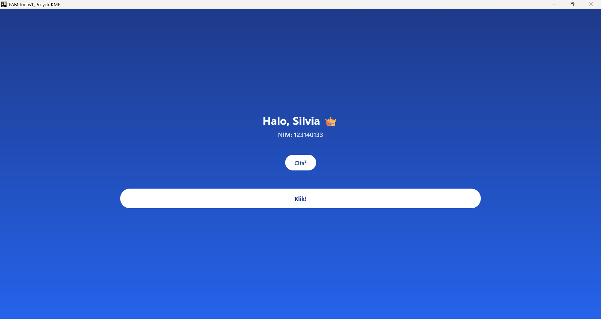
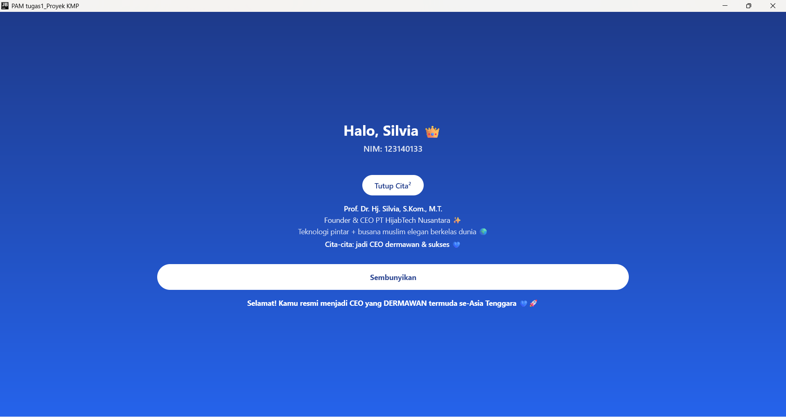
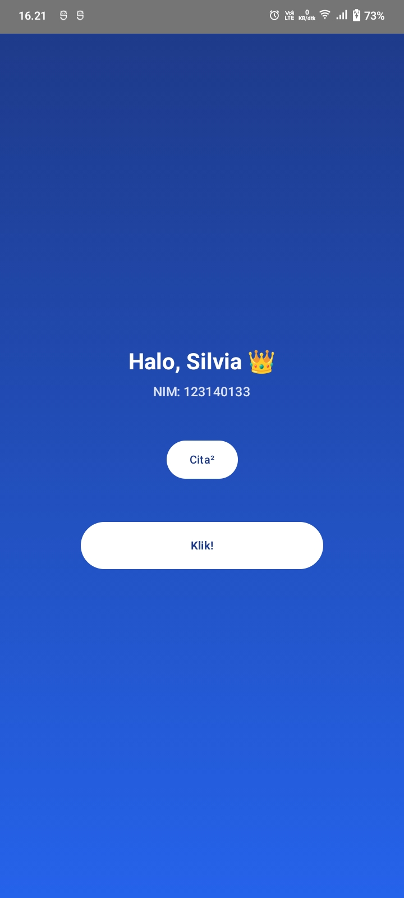
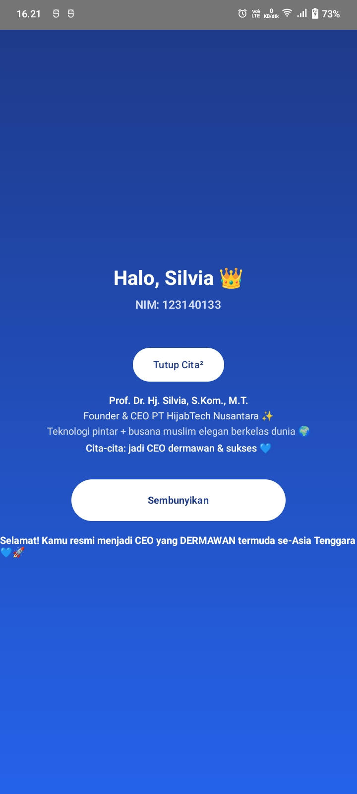

# 💙 Tugas Minggu 1 - Pengembangan Aplikasi Mobile

**IF25-22017 Pengembangan Aplikasi Mobile**  
Program Studi Teknik Informatika  
Institut Teknologi Sumatera (ITERA)

---

## 👩‍💻 Identitas Mahasiswa

**Nama:** Silvia  
**NIM:** 123140133  
**Kelas:** Pengembangan Aplikasi Mobile RB 

---

## 📌 Deskripsi Tugas

Tugas minggu ke-1 ini bertujuan untuk memahami dasar penggunaan  
**Kotlin Multiplatform (KMP)** dengan langkah-langkah berikut:

1. Melakukan setup environment pengembangan menggunakan:
   - Android Studio  
   - Kotlin Multiplatform (KMP) Plugin  
   - JDK 17  
2. Membuat proyek baru dengan template **Compose Multiplatform**
3. Memodifikasi aplikasi bawaan *Hello World* dengan:
   - Mengubah teks menjadi  
     ➝ **"Halo, Silvia 👑!"**
   - Menambahkan **NIM Mahasiswa**
4. Menjalankan aplikasi pada minimal satu platform  
   (Android atau Desktop)

---

## ✨ Hasil Implementasi

## 📸 Screenshot Aplikasi

### 💻 Desktop (JVM)

  
  

### 📱 Android

  
  

---

